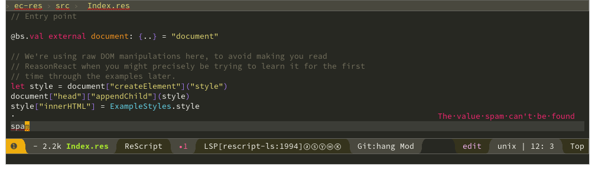

Emacs major mode for ReScript, part of [experimental](#support) Emacs support
for the [ReScript Language](https://rescript-lang.org/).

New ReScript users are advised to use one of the [editors with official support
from the ReScript
team](https://rescript-lang.org/docs/manual/latest/editor-plugins).

## How to Get it Working

Apart from a working [ReScript install](https://rescript-lang.org/docs/manual/latest/installation) and this code, for a full setup you need:

* Strongly recommended: Emacs 27.0 or newer built with native JSON support, for LSP performance
* [rescript-vscode](https://github.com/rescript-lang/rescript-vscode) to provide the ReScript LSP server for type information, compiler errors, and completion
* Currently, [a way to format ReScript code](#formatting) (LSP also provides this, but there is an lsp-mode bug I need to report/fix before this works)

The instructions here assume that you're using [LSP mode](https://emacs-lsp.github.io/lsp-mode/).  [eglot](https://github.com/joaotavora/eglot) may work too, I haven't tried it.

### rescript-vscode

TODO: bundle this or provide a way of auto-installing it

Fetch [the rescript repo](https://github.com/rescript-lang/rescript-vscode) and compile it with:

    npm run compile

The language server should then be present as `server/out/server.js`

### Vanilla Emacs

`rescript-mode` itself does not depend on `lsp-mode`.  `lsp-rescript` provides
configuration code for `lsp-mode` and depends on `rescript-mode`.

Install the following packages(e.g. using `M-x package-install` -- you can use
things like use-package if you like of course):

* lsp-rescript
* lsp-ui

Add the following to your Emacs configuration code (for example to `~/.emacs`):

    ;; Tell `rescript-mode` how to run your copy of `server.js` from rescript-vscode
    ;; (you'll have to adjust the path here to match your local system):
    (customize-set-variable
     'lsp-rescript-server-command
       '("node" "/path/to/rescript-vscode/server/out/server.js" "--stdio"))
    (with-eval-after-load 'rescript-mode
      ;; Tell `lsp-mode` about the `rescript-vscode` LSP server
      (require 'lsp-rescript)
      ;; Enable `lsp-mode` in rescript-mode buffers
      (add-hook 'rescript-mode-hook 'lsp-deferred)
      ;; Enable display of type information in rescript-mode buffers
      (require 'lsp-ui)
      (add-hook 'rescript-mode-hook 'lsp-ui-doc-mode))

Restart Emacs and open a ReScript `.res` file and you should have all the
features working.

Note that the vanilla Emacs handles the LSP prompt for `"Start a build for this
project to get the freshest data?"` on opening a ReScript file in a rather
unfriendly way: you have to hit `TAB` to see the single possible `Start a Build`
response, then hit return.


### Spacemacs

TODO: make a configuration layer

Add `lsp` to the `dotspacemacs-configuration-layers` section of your spacemacs
configuration file (`SPC f e d` to find that file) -- it should look something
like this:

```
dotspacemacs-configuration-layers
'(
  lsp
  )
```

Add `rescript-mode` and `lsp-rescript` to the `dotspacemacs-additional-packages`
section of your spacemacs configuration file -- it should look something like
this:

```
dotspacemacs-additional-packages
'(
  lsp-rescript
  rescript-mode
  )
```

Add this to the `dotspacemacs/user-config` section of your spacemacs
configuration file:

    ;; Tell `rescript-mode` how to run your copy of `server.js` from rescript-vscode
    ;; (you'll have to adjust the path here to match your local system):
    (custom-set-variables
     '(lsp-rescript-server-command
       '("node" "/path/to/rescript-vscode/server/out/server.js" "--stdio")))
    (with-eval-after-load 'rescript-mode
      ;; Tell `lsp-mode` about the `rescript-vscode` LSP server
      (require 'lsp-rescript)
      ;; All I remember is something weird happened if this wasn't there :-)
      (spacemacs|define-jump-handlers rescript-mode)
      ;; Enable `lsp-mode` in rescript-mode buffers
      (add-hook 'rescript-mode-hook 'lsp-deferred)
      ;; Enable display of type information in rescript-mode buffers
      (require 'lsp-ui)
      (add-hook 'rescript-mode-hook 'lsp-ui-doc-mode))

Restart spacemacs (`SPC q r`) and open a ReScript `.res` file and you should
have all the features working.


### Formatting

You can use a package like
[`format-all`](https://github.com/lassik/emacs-format-all-the-code) or
[`reformatter`](https://github.com/purcell/reformatter.el) to get your code
formatted correctly (i.e. as `bsc -format`, soon to be renamed `rescript
format`, formats it -- this is like `gofmt` for ReScript).  See [this
thread](https://forum.rescript-lang.org/t/rescript-emacs-support-with-rescript-vscode/1056/14)
(I've not tried either of these).

`lsp-mode` will make this part unnecessary when I get around to submitting a fix
for an `lsp-mode` bug that currently causes `lsp-format-buffer` not to work with
rescript-vscode.

#### Formatting vs. Indentation

In case the distinction is unclear:

Formatting: This means that you run an Emacs command, and your whole buffer (or
some section of it that you specify maybe) is magically formatted correctly --
that is, in the way that `bsc -format` formats it.

Indentation: This means that hitting the tab key or the return key (depending
how you have things configured I guess) gives you an approximation of the
“official” formatting of a tool like `bsc -format`. It’s never identical to
proper formatting, but stops you having to pay attention to formatting when
writing code.


## Features

Aside from the usual font-lock and indentation provided by any language major
mode, this is what is provided by LSP:

### Builds and Errors

You should see any errors show up via flycheck -- for me they look like this:



With lsp-mode at the time of writing, it seems these errors only show up when
you save.

If you don't see that, `bsc` may not be running on your project.

When you open a `.res` file in your project, you should see a prompt in Emacs
`"Start a build for this project to get the freshest data?"`.  You can either
hit return on `Start Build` to say yes to that and the LSP server will start a
build for you, or `C-g` out of that and run `bsc` yourself however you usually
do that in your rescript project (in my project I run `npm start`).  If you
never want to see this prompt you can put this in your configuration:

    (custom-set-variables '(lsp-rescript-prompt-for-build nil))

If you don't see the `"Start a build for this project to get the freshest
data?"` prompt, you may have a stale `.bsb.lock` lock file in your project.

### Type Information

The configuration above enables `lsp-ui-doc-mode`, because that's the only way I
know to get useful type information with this LSP server and `lsp-mode.el`.
There may be other ways I don't know about.

With `lsp-ui-doc-mode`, hovering with the mouse or moving point to some code
should give a popup like this:


If you don't like it popping up automatically, you can leave `lsp-ui-doc-mode`
off and just use `lsp-ui-doc-glance` every time you want to see it.

### Completion

`lsp-mode`'s completion UI is provided by `company-mode`, so take a look at the
docs for the latter for more about that.


## Known Issues

I've barely used this yet, so probably a lot of things are very broken!

See the github issues, but notably:

* Indentation (note below re formatting vs indentation) is a terrible hack: it's
  lifted straight from js-mode with little effort to adapt it to ReScript, and
  without any JSX support.  Nevertheless, aside from JSX it seems to work OK.
  This doesn't look like a small task to fix, though quite possibly just
  starting with `js.el` and adding the small amount of code in rescript-mode.el
  would result in something useable -- but then the likelihood of my fixing any
  bugs at all would probably drop to zero!  It's also possible that a smaller
  subset of the JSX support can be extracted -- it's not obvious to me that
  that's easy though.  So I'm inclined to lean heavily on `bsc -format` code
  formatting and not worry about JSX indentation until the day our emacs
  ReScript hero comes.
* Font lock and indentation are broken for things like `let \"try" = true`.
* Formatting with `lsp-format-buffer` is broken because it does not correctly
  handle the response from rescript-vscode because it uses a range like
  `"end":{"line":1.7976931348623157e+308,"character":1.7976931348623157e+308}`
  -- this should be easy to fix and [you can use other means](#formatting) to do
  this.

Packaging issues:

* Teach lsp-mode how to install rescript-vscode, or bundle it
* Add spacemacs layer

## Support

Please do not report issues related to editor support with Emacs upstream to the
ReScript or rescript-vscode projects (neither on the forum nor the github
issues).  For now please use github issues on this project as a place to discuss
Emacs ReScript support.

Emacs is NOT SUPPORTED by the ReScript core team, nor rescript-vscode. The core
ReScript team’s focus for editor support is currently on supporting VS Code and
Sublime Text well. So, if you want something that you can be confident is going
to work smoothly and will not go away, use one of the editors listed as
supported by the core ReScript team (currently VS Code and Sublime Text). In
particular, the Emacs support here depends on the LSP server from
rescript-vscode and its --stdio switch, neither of which are officially
supported and could be removed in a later version.

So if you have problems with Emacs and ReScript, please report your issues here,
not upstream with ReScript or rescript-vscode and please don’t complain if you
used ReScript with Emacs and had a bad time – if you did that, you’re going it
alone and you really didn’t try the official ReScript experience – that’s unfair
and a good way to annoy everybody.

This code is unpolished, expect to run into issues if you choose to use it.
